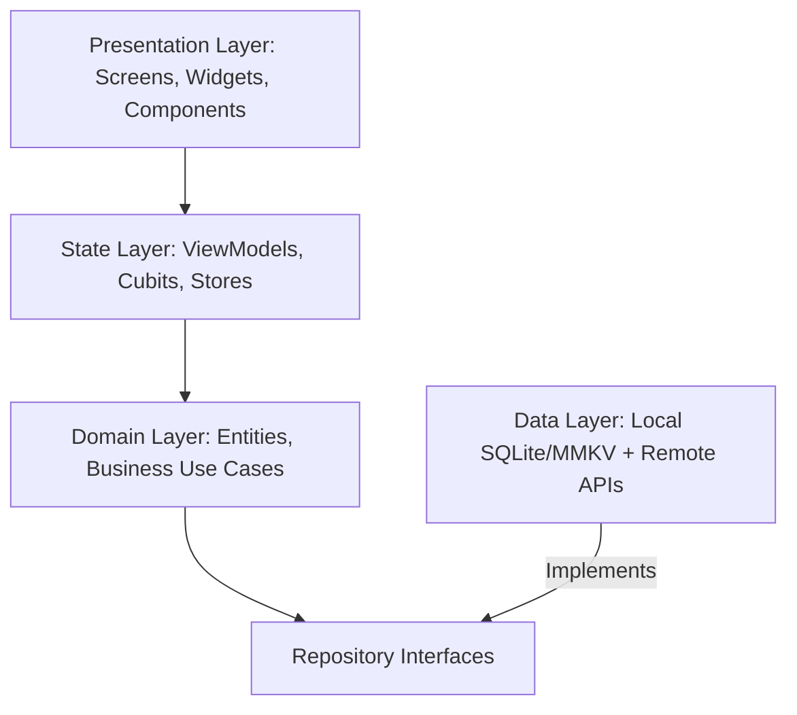

# Mobile & Desktop Architecture Blueprint

## 1. Domain-Driven Layer Hierarchy

## 2. State Management Heuristics
- **Ephemeral State**: Keep localized animation or form draft state strictly inside the widget/component.
- **App State**: Manage global authentication, user profiles, and theme preferences through a centralized, immutable store.
- **Server Cache State**: Utilize dedicated query caching for remote entity collections with automatic revalidation.

## 3. Storage & Sync Strategy
- **Key-Value Store**: Use high-speed key-value caches for tokens, user preferences, and flags.
- **Relational / Document DB**: Use structured SQLite or embedded document storage for relational domain entities requiring complex filtering.
- **Sync Queue**: Maintain a persistent offline mutation queue that replays network mutations upon connectivity restoration.
