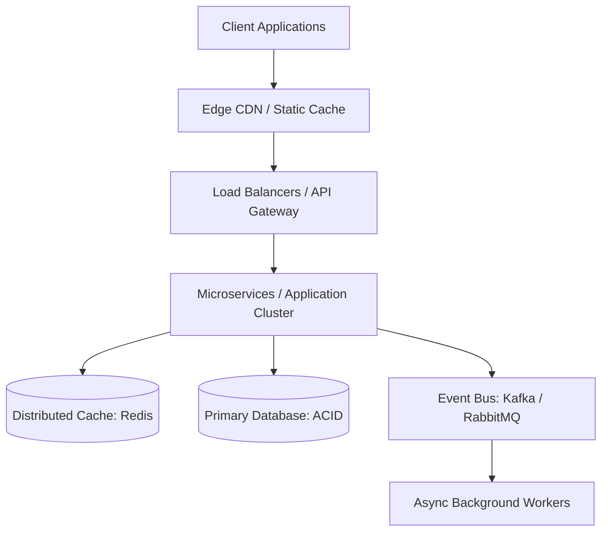

# High-Scale System Design Framework

## 1. Core Architectural Trade-Off Analysis

## 2. Distributed Scaling Heuristics
- **CAP Theorem Stance**: Formally decide between Consistency (CP) or Availability (AP) during network partitions based on business domain.
- **Caching Patterns**: Choose between Cache-Aside (default reads), Write-Through (strong consistency), or Write-Behind (high write volume).
- **Database Scaling**: Implement indexing audits first $\to$ Read-Replicas second $\to$ Partitioning/Sharding third.
- **Backpressure & Rate Limiting**: Apply token-bucket or sliding-window rate limiters at the API Gateway to guard downstream microservices.
