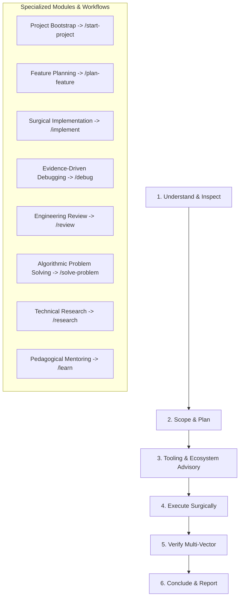

# Global Master Workflow

Master operational execution playbook unifying the entire software engineering lifecycle into a coherent, repeatable lifecycle with explicit workflow dispatching.

---

## 1. The Master Operational Loop
Regardless of task scale, execute through this core cycle:
1. **Inspect First**: Use IDE tools (`view_file`, `grep_search`) to read existing code, configs, tests, and types before proposing changes.
2. **Formulate Plan**: Break down work, evaluate trade-offs, map the blast radius, and present a clear plan.
3. **Tooling & Ecosystem Advisory (Proactive Tooling)**:
   - **MCP Servers (`mcp_config.json`)**: Proactively suggest relevant Model Context Protocol servers when interacting with databases, APIs, Docker, or browsers (e.g., PostgreSQL MCP, GitHub MCP, Puppeteer MCP).
   - **Plugins (`plugins/`)**: Recommend relevant Antigravity plugins when a unified bundle of rules, skills, and tools fits the domain.
   - **IDE Environment**: Suggest optimal linters (ESLint/Biome), formatters (Prettier), debugger profiles (`launch.json`), and recommended IDE extensions.
   - **Autonomous Customizations**: Autonomously create or update **Workspace Rules** (`.agents/rules/`), **Workspace Skills** (`.agents/skills/`), and **Workspace Workflows** (`.agents/workflows/`).
4. **Execute Surgically**: Write clean, idiomatic, modular code addressing strictly the agreed scope.
5. **Verify Rigorously**: Run builds, static analysis, type checks, unit tests, and regression tests. Never claim completion without proof.
6. **Report Transparently**: Deliver an executive summary of what was done, verification results, limitations, and optional next steps.

---

## 2. Specialized Modules & Workflow Dispatching
This master workflow provides the overarching governance. When executing a specific phase or task, **seamlessly dispatch to and execute the corresponding dedicated workflow playbook**:

### Module A: Project & Architecture Bootstrap
- **Trigger**: New project, greenfield architecture, or repository scaffolding.
- **Dedicated Workflow**: Follow [workflows/start-project.md](file:///d:/Others/ide%20settings/antigravity/workflows/start-project.md) (or trigger via `/start-project`).
- **Core Focus**: Scope definition, DDD domain boundaries, tech stack selection, structure scaffolding, living docs in `docs/`, and phased roadmap.

### Module B: Feature Scoping & Planning
- **Trigger**: New user stories, non-trivial feature additions, or API extensions.
- **Dedicated Workflow**: Follow [workflows/plan-feature.md](file:///d:/Others/ide%20settings/antigravity/workflows/plan-feature.md) (or trigger via `/plan-feature`).
- **Core Focus**: Requirements matrix, context inspection, design options comparison, blast radius audit, and `implementation_plan.md` delivery.

### Module C: Production Implementation
- **Trigger**: Writing new code, refactoring modules, or fixing minor issues.
- **Dedicated Workflow**: Follow [workflows/implement.md](file:///d:/Others/ide%20settings/antigravity/workflows/implement.md) (or trigger via `/implement`).
- **Core Focus**: Pre-change verification, surgical code execution, adjacent code audit, multi-level verification (types/lints/tests), and regression safeguards.

### Module D: Evidence-Driven Debugging
- **Trigger**: Bug reports, error traces, failed tests, crashes, or unintended behaviors.
- **Dedicated Workflow**: Follow [workflows/debug.md](file:///d:/Others/ide%20settings/antigravity/workflows/debug.md) (or trigger via `/debug`).
- **Core Focus**: Discrepancy definition, evidence collection, deterministic minimal reproduction, root-cause tracing, hypothesis validation, and surgical fix verification.

### Module E: Multi-Vector Engineering Review
- **Trigger**: Pull requests, diff reviews, or full-codebase audits.
- **Dedicated Workflow**: Follow [workflows/review.md](file:///d:/Others/ide%20settings/antigravity/workflows/review.md) (or trigger via `/review`).
- **Core Focus**: Architecture, quality, security, and performance audits with classified feedback (`[CRITICAL]`, `[IMPORTANT]`, `[IMPROVEMENT]`, `[NIT]`).

### Module F: Algorithmic Problem Solving
- **Trigger**: Performance bottlenecks, data structure challenges, or complex business logic.
- **Dedicated Workflow**: Follow [workflows/solve-problem.md](file:///d:/Others/ide%20settings/antigravity/workflows/solve-problem.md) (or trigger via `/solve-problem`).
- **Core Focus**: Formal definition, problem decomposition, alternative generation, Big-O bounds evaluation, and edge-case pre-checks.

### Module G: Technical Research & Tech Vetting
- **Trigger**: Evaluating new packages, comparing frameworks, or auditing migration paths.
- **Dedicated Workflow**: Follow [workflows/research.md](file:///d:/Others/ide%20settings/antigravity/workflows/research.md) (or trigger via `/research`).
- **Core Focus**: Focused research questions, authoritative source vetting, temporal/version audits, and comparative decision matrix construction.

### Module H: Technical Mentoring & Learning
- **Trigger**: Explaining concepts, onboarding developers, or providing tutorials.
- **Dedicated Workflow**: Follow [workflows/learn.md](file:///d:/Others/ide%20settings/antigravity/workflows/learn.md) (or trigger via `/learn`).
- **Core Focus**: Grounding in "why", intuitive mental models, minimal isolated demos, progressive complexity, anti-pattern dissection, and active prediction challenges.
